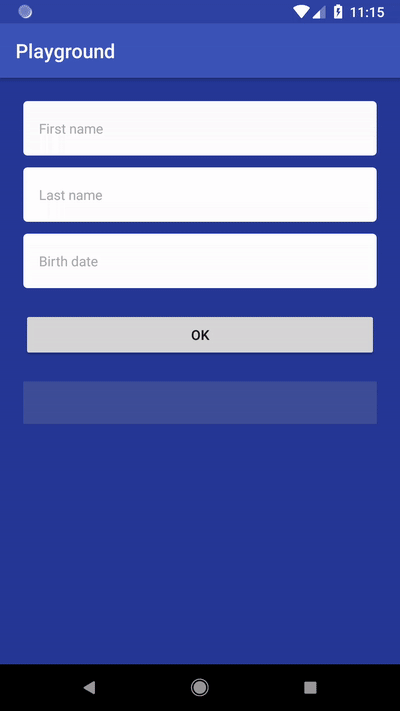

# FormField

A custom form field I developed for an Android application. This is not a library.

# Main features
- editable and non-editable mode (see birthday dialog example)
- three sources of error messages (required, invalid and error)
- validators
- configuration via XML attributes
- preserves the state after configuration changes
- some nice animations

See [MainActivity.java](app/src/main/java/io/github/eduardvasilache/formfield/MainActivity.java) and [activity_main.xml](app/src/main/res/layout/activity_main.xml) for detailed example of usage.